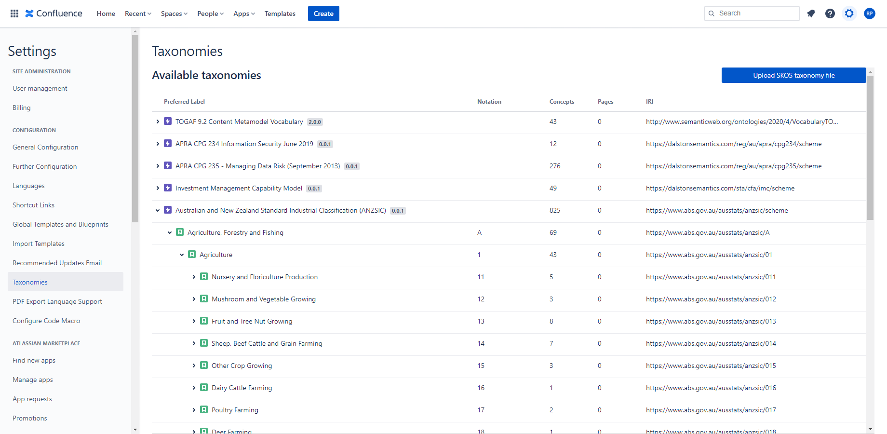
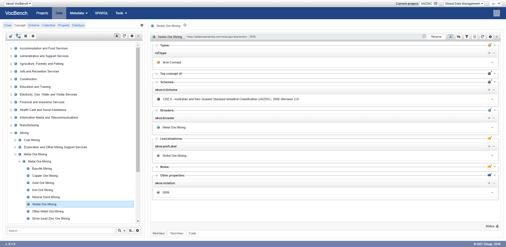

# Australian and New Zealand Standard Industrial Classification (ANZSIC) 2006 (Revision 2.0)

SKOS version of [Australian and New Zealand Standard Industrial Classification (ANZSIC)](https://www.abs.gov.au/AUSSTATS/abs@.nsf/DetailsPage/1292.02006%20(Revision%202.0)?OpenDocument).

Use it with [Confluence Semantics](https://dalstonsemantics.com/confluence-semantics) to annotate Confluence pages and track alignment with ANZSIC.

Developed with [Simple Knowledge Organization System (SKOS)](https://www.w3.org/2004/02/skos/) this taxonomy can also be imported and published with [controlled vocabulary tools](https://github.com/gbv/bartoc.org/wiki/Software-for-controlled-vocabularies) to improve staff awareness of data risks.

## Attribution and Disclaimer

### Sources

[Australian Bureau of Statistics](https://www.abs.gov.au/) is the source of all labels and definitions in the taxonomy.

### Copyright in the original material

(C) Commonwealth of Australia 2013 

This work is copyright. Apart from any use as permitted under the Copyright Act 1968, no part may be reproduced by any process without prior written permission from the Commonwealth. Requests and inquiries concerning reproduction and rights in this publication should be addressed to The Manager, Intermediary Management, Australian Bureau of Statistics, Locked Bag 10, Belconnen ACT 2616, by telephone (02) 6252 6998, fax (02) 6252 7102, or email: <intermediary.management@abs.gov.au>. 

In all cases the ABS must be acknowledged as the source when reproducing or quoting any part of an ABS publication or other product. 