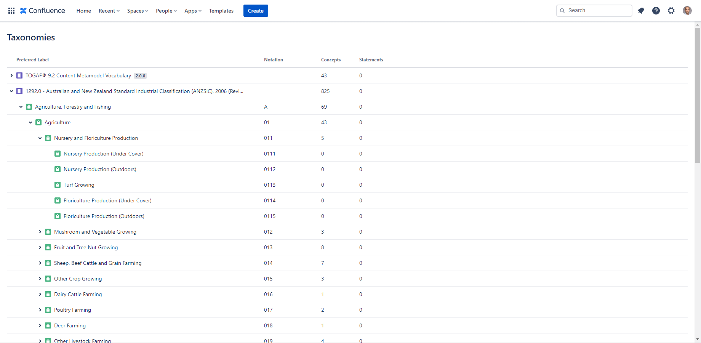

# Australian and New Zealand Standard Industrial Classification (ANZSIC)

SKOS version of [1292.0 - Australian and New Zealand Standard Industrial Classification (ANZSIC), 2006 (Revision 2.0) Released at 11:30 AM (CANBERRA TIME) 26/06/2013](https://www.abs.gov.au/AUSSTATS/abs@.nsf/DetailsPage/1292.02006%20(Revision%202.0)?OpenDocument).

Titles are retrieved from [1292.0.55.002 - Australian and New Zealand Standard Industrial Classification (ANZSIC), 2006 - Codes and Titles, 2006 Released at 11:30 AM (CANBERRA TIME) 28/02/2006](https://www.abs.gov.au/AUSSTATS/abs@.nsf/DetailsPage/1292.0.55.0022006?OpenDocument) and validated against both ANZSIC revisions.

Use it as reference data, including with [Taxonomies for Confluence](https://dalstonsemantics.com/services/taxonomies-for-confluence/) to index documentation stored in [Confluence](https://www.atlassian.com/software/confluence).

Developed with [Simple Knowledge Organization System (SKOS)](https://www.w3.org/2004/02/skos/) this taxonomy can also be imported and published with [many controlled vocabulary tools](https://github.com/gbv/bartoc.org/wiki/Software-for-controlled-vocabularies).

## Attribution

Source: [Australian Bureau of Statistics](www.abs.gov.au).